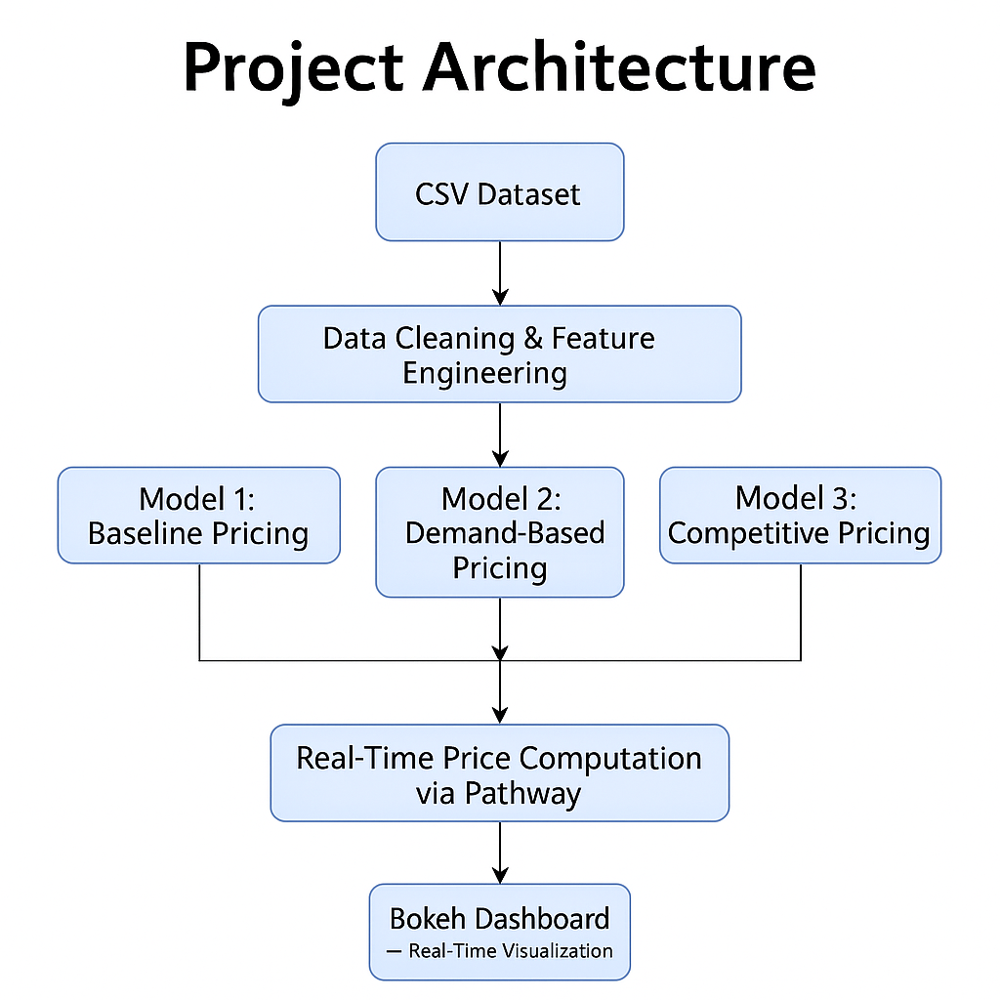

# 🚗 Dynamic Pricing for Urban Parking Lots

**Capstone Project | Summer Analytics 2025**  
Hosted by Consulting & Analytics Club × Pathway

---

## 📌 Project Overview

This project simulates a **dynamic pricing engine** for 14 urban parking lots using real-time data streams and intelligent ML-inspired models. The goal is to optimize price based on demand, occupancy, congestion, competition, and more — thereby improving utilization and user experience.

---

## 🛠️ Tech Stack

- **Python**
- **NumPy**, **Pandas** – Data processing
- **Bokeh** – Real-time visualizations
- **Pathway** – Real-time data streaming and event simulation
- **Google Colab** – Execution environment

---

## 🧱 Project Architecture



> *Diagram: CSV → Feature Engineering → Models 1/2/3 → Real-Time Computation (Pathway) → Bokeh Dashboard*

---

## 🔄 Workflow & Components

1. **Data Preprocessing**
   - Loaded and cleaned the dataset (`Occupancy`, `Capacity`, `QueueLength`, etc.)
   - Computed `occupancy_rate`, and handled missing values
   - One-hot encoded categorical features (e.g., `VehicleType`, `TrafficLevel`)

2. **Model 1: Baseline Linear Pricing**
   - Pricing increases linearly with occupancy
   - Formula: `price[t+1] = price[t] + α * occupancy_rate[t]`
   - Acts as a reference for comparison

3. **Model 2: Demand-Based Dynamic Pricing**
   - A weighted formula using:
     - Occupancy rate
     - Queue length
     - Traffic level
     - Special day indicator
     - Vehicle type
   - Demand formula:
     ```
     demand = 0.4 * occupancy_rate + 0.3 * queue_length + 0.1 * is_special_day + vehicle_weight - traffic_penalty
     ```
   - Pricing: `price = base_price * (1 + λ * demand)`
   - Clipped within `[0.5x, 2x]` of base price

4. **Model 3: Competitive Pricing**
   - Used geographic distance (lat-long + KDTree) to find nearest competitor
   - Adjusts price based on:
     - If competitor is cheaper → slightly undercut or reroute
     - If own lot has higher demand → charge a small premium
   - Reroute logic: If occupancy > 90% **and** competitor is cheaper

5. **Real-Time Simulation**
   - Converted data to CSV stream using `Pathway`
   - Used `pw.demo.replay_csv()` to simulate live stream
   - Applied pricing logic on the fly

6. **Bokeh Visualizations**
   - Histogram of occupancy rate
   - Time series plot of hourly average occupancy
   - Real-time price visualization via `ColumnDataSource.stream()`

---

## 📊 Visual Outputs

- 📈 Histogram of occupancy rate (Bokeh)
- 🕒 Time-series of hourly average occupancy
- 💵 Baseline pricing curve for selected lots
- 🔁 Real-time price stream from Pathway shown using Bokeh line charts
- 🔍 Competitor comparison and rerouting flag output

---

## ⚙️ Setup Instructions

```bash
# Install required packages
!pip install pandas numpy bokeh pathway

